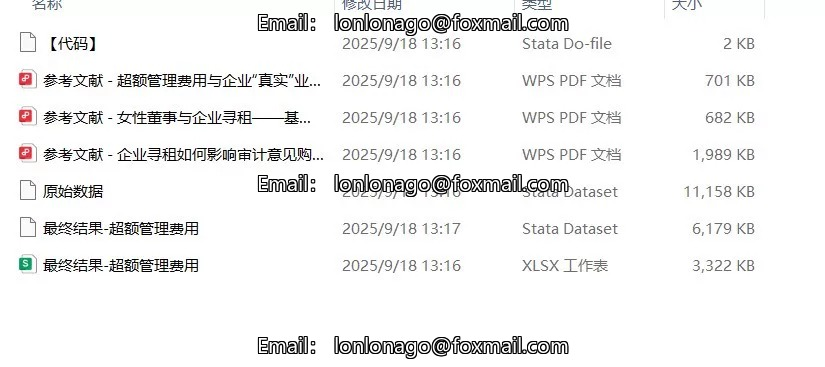
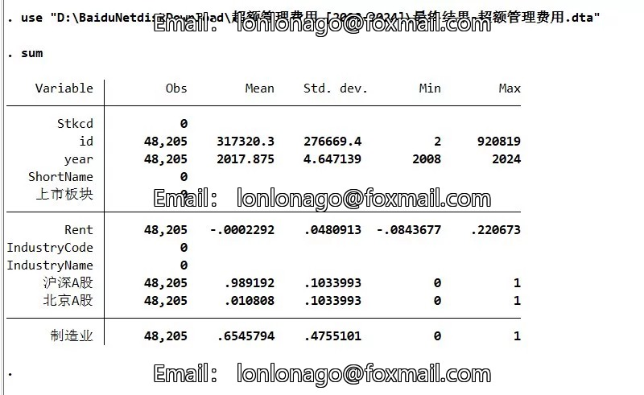
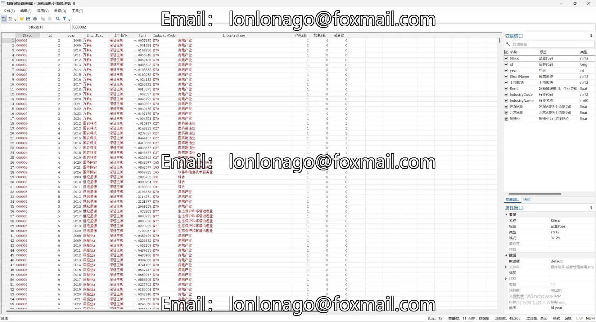

## Body

（2008-2024年）Excessive Management Fees/Corporate Rent Data (2008-2024)

I. Data Introduction
Data Name: Excessive Management Fees/Corporate Rent Data
Sample Scope: All A Group of Companies, with over 48,000 observations (after removal of outliers and codes, which can be removed to obtain the unadjusted results).
Data Format: Excel (results), DTA
Time Range: 2008-2024
Data Content: Codes, raw data, results
Original Data Source: CSM.AR

II. Data Indicators as Shown in the Figure
Rent: Following the approach of Chen Jun et al. (2021), a regression is conducted on the management fee rate, with the residuals representing the excess management fees, denoted as Rent, serving as an proxy variable for corporate rent levels.
The larger the value, the greater the excess management fees, indicating a higher degree of corporate rent.

III. References as Shown in the Figure

## Images

item_977698350776

Here is a pay link on Stripe ( https://buy.stripe.com/3cs8yP7sY87d0vu9AB ). Please contact me lonlonago@foxmail.com after funding $89, and I will send you a complete data files , thank you!

